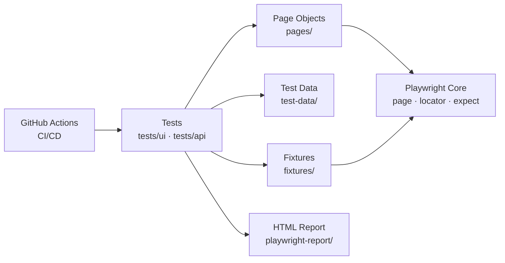

# Playwright Automation Framework

[](https://github.com/kdesai89/playwright-automation-framework/actions/workflows/playwright.yml)


A production-style end-to-end test automation framework built with **Playwright** and **TypeScript**. Demonstrates Page Object Model design, cross-browser execution, centralized test data, and a fully wired CI/CD pipeline with GitHub Actions.

---

## Why This Project Exists

This framework was built to demonstrate how a modern, maintainable test automation suite should be structured in 2026 — the kind of codebase a small QA team can extend without it collapsing under its own weight.

It is intentionally written to mirror what I build in production: clean separation of concerns, no hardcoded selectors in tests, no copy-pasted setup code, and CI that runs every push across three browser engines.

---

## Tech Stack

| Layer | Tool |
|-------|------|
| Test Runner & Framework | Playwright Test |
| Language | TypeScript |
| Design Pattern | Page Object Model (POM) |
| Browsers | Chromium, Firefox, WebKit |
| CI/CD | GitHub Actions |
| Reporting | Playwright HTML Reporter |
| API Testing | Playwright Request Context *(coming soon)* |

---

## Features

- **Cross-browser execution** — every test runs on Chromium, Firefox, and WebKit in parallel
- **Page Object Model** — selectors and page logic live in `pages/`, never in tests
- **Centralized test data** — single source of truth in `test-data/`, no magic strings in tests
- **Strongly-typed API** — TypeScript union types for sort options, fixture types, etc.
- **CI/CD on every push** — GitHub Actions runs the full suite automatically; status badge above is live
- **Rich HTML reports** — screenshots, traces, and timings for every test run
- **Defensive code** — null-safe handling, immutable test data, independent tests (no order dependency)

---

## Architecture



**Folder structure:**

```
playwright-automation-framework/
├── .github/workflows/      # CI/CD pipeline definitions
├── pages/                  # Page Object Model classes
│   ├── LoginPage.ts
│   └── InventoryPage.ts
├── tests/
│   ├── ui/                 # UI test specs
│   │   ├── login.spec.ts
│   │   └── inventory.spec.ts
│   └── api/                # API test specs (coming soon)
├── test-data/              # Centralized test data
│   └── users.ts
├── fixtures/               # Custom Playwright fixtures
├── utils/                  # Shared helper utilities
├── playwright.config.ts    # Framework configuration
└── package.json
```

---

## Test Coverage

**UI flows tested against [SauceDemo](https://www.saucedemo.com/):**

- Login — valid user, locked user, invalid credentials, empty fields
- Inventory — product listing, add/remove cart items, sort by name/price
- Cart — multi-item flows, badge count verification

**Total:** 11 test scenarios × 3 browsers = **33 test runs per CI execution**

---

## Sample Test Report


*All tests passing across Chromium, Firefox, and WebKit.*

---

## Quick Start

### Prerequisites

- Node.js 18+ (recommended: 22 LTS)
- npm 10+

### Install

```bash
git clone https://github.com/kdesai89/playwright-automation-framework.git
cd playwright-automation-framework
npm install
npx playwright install
```

### Run tests

```bash
# Run the full suite across all browsers
npx playwright test

# Run only UI tests
npx playwright test tests/ui

# Run a single spec file
npx playwright test tests/ui/login.spec.ts

# Run on a specific browser
npx playwright test --project=chromium

# Run in headed mode (watch the browser)
npx playwright test --headed

# View the HTML report after a run
npx playwright show-report
```

---

## CI/CD

Every push to `main` triggers a GitHub Actions workflow that:

1. Installs Node.js and dependencies
2. Installs Playwright browser binaries
3. Runs the full test suite across Chromium, Firefox, and WebKit
4. Uploads the HTML report as a downloadable artifact

The badge at the top of this README reflects the latest run.

---

## Design Decisions

A few choices worth calling out:

- **`data-test` selectors over CSS classes.** Class names change with styling refactors; `data-test` attributes are part of the contract between dev and QA and rarely move.
- **Locators initialized in constructors, not in test bodies.** This keeps tests readable and makes selector updates a one-line change.
- **No `if` statements in tests.** Tests are linear assertions of behavior — branching belongs in production code, not test code.
- **One assertion focus per test.** Each test verifies one behavior; multiple assertions are fine as long as they're verifying the same thing.
- **`beforeEach` over global setup.** Each test starts from a known clean state, eliminating order dependencies.

---

## Roadmap

- [x] UI tests for login and inventory flows
- [x] Cross-browser CI/CD on GitHub Actions
- [x] HTML reporting
- [ ] API test suite (Reqres / JSONPlaceholder)
- [ ] Custom fixtures for authenticated sessions
- [ ] Visual regression tests with Playwright screenshots
- [ ] Allure reporting integration
- [ ] Docker container for local CI parity

---

## About the Author

**Karan Desai** — Senior Test Automation Engineer with 11+ years of experience designing and scaling automated testing solutions across healthcare, banking, and insurance domains.

I specialize in building maintainable automation frameworks that scale with engineering teams. Core stack: Selenium, Playwright, Pytest, NUnit, REST APIs, GitLab CI/CD, and Jenkins. I've reduced regression cycles by 75%+ through framework redesigns and CI integration.

**Open to remote Senior Test Automation Engineer / SDET roles.**

- 🌐 [LinkedIn](https://www.linkedin.com/in/karan-desai-24785394/)
- 💻 [GitHub](https://github.com/kdesai89)
- 📧 Karandesai806@gmail.com
- 📍 St. Charles, MO

---

## License

[MIT](LICENSE) — feel free to use this framework as a reference for your own projects.
